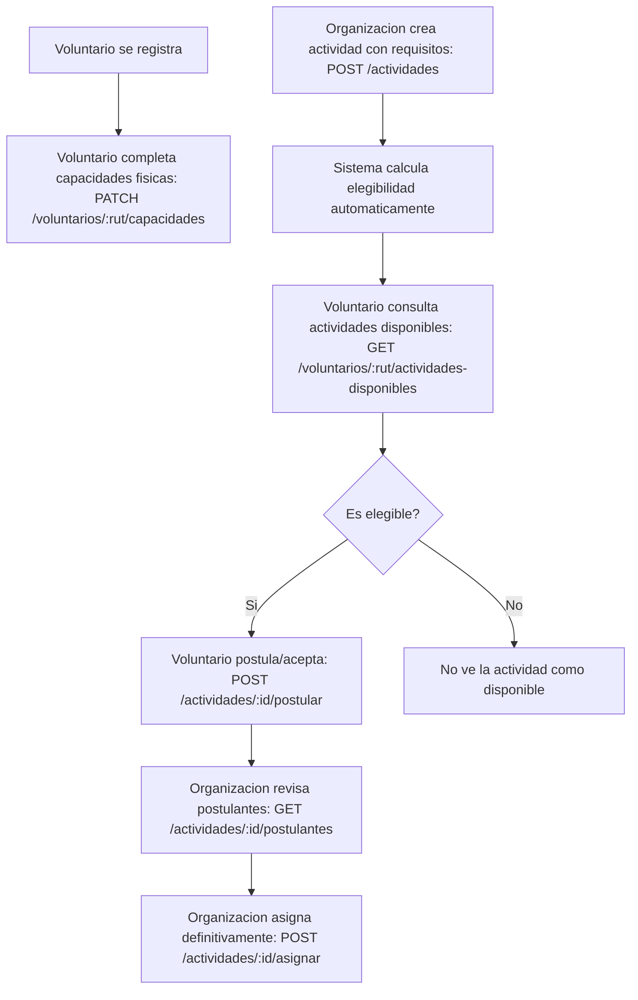

# DOCUMENTACION PARA LOS DESARROLLADORES

# Implementación de Gestión de Voluntarios

Se ha integrado el módulo de gestión de voluntarios desde el directorio `src/` al repositorio `Backend-Meto/`. Debido a que `Backend-Meto` utiliza **Sequelize** y el código original utilizaba **TypeORM**, se realizó una traducción completa de la capa de datos y lógica de negocio.

Posteriormente, este módulo se amplió para cubrir el requisito **"GESTIÓN DE VOLUNTARIOS"** de `info-proyecto/REQUISITOS_SISTEMA.md`:

> El sistema permitirá que los voluntarios, una vez registrados, completen y actualicen su perfil con información complementaria, incluyendo sus capacidades físicas... Cuando una organización publique una actividad, el sistema verificará automáticamente qué voluntarios disponibles cumplen con los requisitos definidos para dicha actividad... Solo estos voluntarios podrán visualizar la opción de postular o aceptar la invitación... La asignación definitiva del voluntario a la actividad será realizada por la organización responsable, una vez que el voluntario confirme su disponibilidad y aceptación.

Este documento cubre ambas etapas: la implementación inicial del CRUD de voluntarios y la ampliación con capacidades físicas, requisitos de actividades y postulaciones.

---

# Parte 1 — Implementación inicial: CRUD de Voluntarios

## 🛠 Cambios Realizados

### 1. Dependencias
- Instalación de `joi` para la validación de esquemas de entrada de datos.

### 2. Nuevos Archivos y Componentes
Los archivos fueron renombrados o creados con prefijos específicos para evitar conflictos con la estructura existente:

| Archivo | Propósito |
| :--- | :--- |
| `src/entities/VoluntarioModels.js` | Definición de modelos de Sequelize para Voluntarios, Roles, Datos Médicos, Asistencia, Bitácora, Proyectos, Cuadrillas, Reportes y Alertas. |
| `src/services/voluntarioService.js` | Lógica de negocio para el CRUD de voluntarios (creación, lectura, actualización y borrado lógico). |
| `src/controllers/voluntarioController.js` | Manejo de peticiones HTTP y orquestación entre validaciones y servicios. |
| `src/routes/voluntarioRoutes.js` | Definición de los endpoints para la gestión de voluntarios. |
| `src/validations/voluntarioValidations.js` | Esquemas de validación de datos utilizando Joi. |
| `src/handlers/responseHandler.js` | Utilidad para estandarizar las respuestas de éxito y error de la API. |

### 3. Integración en la App
- Se actualizaron las importaciones en `src/app.js`.
- Se registró el prefijo de ruta `/api/voluntarios` para acceder a todas las funcionalidades del CRUD.

## 🚀 Endpoints Implementados

| Método | Endpoint | Descripción |
| :--- | :--- | :--- |
| `POST` | `/api/voluntarios` | Crea un nuevo voluntario. |
| `GET` | `/api/voluntarios` | Obtiene la lista de voluntarios (soporta query `incluirInactivos=true`). |
| `GET` | `/api/voluntarios/:rut` | Obtiene el detalle de un voluntario por su RUT. |
| `PATCH` | `/api/voluntarios/:rut` | Actualiza la información de un voluntario. |
| `DELETE` | `/api/voluntarios/:rut` | Realiza un borrado lógico (cambia `activo` a `false`). |

## 📝 Notas Técnicas
- **Traducción de ORM**: Se mapearon las entidades de TypeORM a `sequelize.define`.
- **Relaciones**: Se establecieron las asociaciones `belongsTo` y `hasMany` para mantener la integridad referencial de la base de datos.
- **Seguridad**: Se mantuvo el hashing de contraseñas mediante `bcryptjs` antes de la persistencia.


## Formato JSON para crear voluntario en la API

```json
{
  "rut": "21699026-9",
  "password": "password123",
  "nombre": "Juan",
  "apellido": "Pérez",
  "email": "juan.perez@example.com",
  "edad": 25,
  "contacto": "56912345678",
  "activo": true,
  "clasificacion": "obrero",
  "contacto_emergencia": "56987654321",
  "rol_id": "ROL_GEN"
}
```

## Formato de ruta para eliminar un voluntario (borrado lógico)

``` /api/voluntarios/12345678-9 ```

---

# Parte 2 — Ampliación: Capacidades físicas, requisitos de actividades y postulaciones

## Restricciones acordadas antes de implementar

- ❌ No se implementaron certificaciones del voluntario (quedó fuera de alcance).
- ❌ No se modificó el flujo de autenticación (`authService`, `authController`, `authMiddleware`).
- ❌ No se modificó el sistema de roles (`roleMiddleware`, enum de `User.role`); solo se **reutilizaron** los roles ya existentes (`admin`, `coordinator`, `staff`) para las acciones de "organización".
- ✅ Capacidades físicas con niveles categóricos: `baja` / `media` / `alta`.
- Sin datos productivos, por lo que se usó `sequelize.sync({ alter: true })` (mecanismo ya existente en el proyecto) para aplicar los cambios de esquema.

## Decisión de diseño: identidad del voluntario en las rutas

`voluntarioRoutes.js` ya operaba (antes de este cambio) sin middleware de autenticación, identificando al voluntario por `:rut` en la URL. Se mantuvo ese mismo patrón para las acciones que ejecuta el voluntario (actualizar capacidades, ver actividades disponibles, postularse), en vez de introducir un nuevo mecanismo de identidad vía JWT, tal como se acordó ("no tocar autenticación de voluntarios").

Las acciones de "la organización" (ver elegibles, ver postulantes, asignar) sí usan `verifyToken` + `authorizeRole('admin', 'coordinator', 'staff')`, exactamente igual a como ya estaban protegidas las demás rutas de `actividadRoutes.js`.

---

### 1. Modelo de datos

#### `src/entities/VoluntarioModels.js`
- **Nueva entidad `CapacidadFisica`** (tabla `capacidad_fisica`), relación 1:1 con `UsuarioVoluntario` (mismo patrón que `DatosMedicos`):
  - `movilidad`: ENUM('baja','media','alta')
  - `resistencia_fisica`: ENUM('baja','media','alta')
  - `capacidad_carga`: ENUM('baja','media','alta')
  - `otras_habilidades`: TEXT
- **`UsuarioVoluntario`**: se agregó la columna `id_capacidad_fisica` (FK opcional hacia `CapacidadFisica`), con su asociación `belongsTo`/`hasOne`.

#### `src/entities/ActividadModels.js`
- Se agregaron a `Actividad` los requisitos opcionales para postular:
  - `edad_minima`, `edad_maxima`: INTEGER
  - `movilidad_requerida`, `resistencia_requerida`, `capacidad_carga_requerida`: ENUM('baja','media','alta')
- Si un requisito no se define, la actividad queda abierta a cualquier voluntario respecto a ese criterio.

#### `src/entities/PostulacionModels.js` (nuevo archivo)
- **Nueva entidad `PostulacionActividad`** (tabla `postulacion_actividad`), que representa la relación voluntario ↔ actividad:
  - `estado`: ENUM('postulado', 'asignado', 'rechazado')
  - `fecha_postulacion`, `fecha_asignacion`, `asignado_por`
  - Índice único por (`id_actividad`, `rut_voluntario`) para evitar postulaciones duplicadas.

#### `src/entities/index.js`
- Se agregaron `ActividadModels` y `PostulacionModels` a las exportaciones centralizadas.

---

### 2. Lógica de negocio (servicios)

#### `src/services/elegibilidadService.js` (nuevo)
Determina si un voluntario cumple los requisitos de una actividad:
- Compara niveles categóricos con un orden `baja(1) < media(2) < alta(3)`. Si la actividad no exige un nivel, cualquier voluntario lo cumple; si lo exige y el voluntario no tiene el dato registrado, no califica.
- Valida rango de edad (`edad_minima`/`edad_maxima`).
- Expone `esVoluntarioElegible(voluntario, actividad)` y `getVoluntariosElegibles(actividad)`.

#### `src/services/postulacionService.js` (nuevo)
Orquesta el flujo completo:
- `getActividadesDisponibles(rut)` — actividades `pendiente` para las que el voluntario es elegible y aún no se ha postulado.
- `postularOAceptar(rut, idActividad)` — valida elegibilidad y crea la postulación (estado `postulado`). Rechaza si el voluntario no califica (403) o ya se había postulado (409).
- `listarPostulantes(idActividad)` — para que la organización vea quiénes se postularon/fueron asignados.
- `obtenerVoluntariosElegibles(idActividad)` — lista de voluntarios activos que cumplen los requisitos, se hayan postulado o no.
- `asignarVoluntario(idActividad, rut, asignadoPor)` — asignación definitiva; solo procede si el voluntario ya está en estado `postulado`.

#### `src/services/voluntarioService.js`
- Se agregó `actualizarCapacidadFisica(rut, payload)`: crea el registro de `CapacidadFisica` la primera vez y lo actualiza en las siguientes llamadas.
- `getAllVoluntarios` y `getVoluntarioByRut` ahora incluyen la asociación `capacidad_fisica` en la respuesta.

#### `src/services/actividadService.js`
- `CrearActividad` y `ModificarActividad` ahora reciben y persisten los campos de requisitos (`edad_minima`, `edad_maxima`, `movilidad_requerida`, `resistencia_requerida`, `capacidad_carga_requerida`).

---

### 3. Validaciones (Joi)

#### `src/validations/voluntarioValidations.js`
- Nueva regla `nivelCapacidadRule` (`baja`/`media`/`alta`).
- Nuevo esquema `capacidadFisicaSchema` (todos los campos opcionales, mínimo uno requerido).

#### `src/validations/actividadValidation.js`
- Nuevas reglas `nivelRequeridoRule` y `edadRequeridaRule`.
- `createActividadSchema` y `updateActividadSchema` ahora aceptan los campos de requisitos, con validación cruzada: `edad_minima` no puede ser mayor que `edad_maxima`.

---

### 4. Controladores

#### `src/controllers/voluntarioController.js`
- `actualizarCapacidadFisica` — `PATCH /api/voluntarios/:rut/capacidades`
- `obtenerActividadesDisponibles` — `GET /api/voluntarios/:rut/actividades-disponibles`

#### `src/controllers/postulacionController.js` (nuevo)
- `obtenerVoluntariosElegibles`, `postularOAceptar`, `listarPostulantes`, `asignarVoluntario`

#### `src/controllers/actividadController.js`
- **Corrección de bug preexistente** (no relacionado con este requisito): `crearActividad` llamaba a `actividadService.crearActividad` (minúscula), pero el servicio exporta `CrearActividad`. Esto hacía que la creación de actividades fallara siempre con `500 - actividadService.crearActividad is not a function`. Se corrigió la referencia a `actividadService.CrearActividad`, ya que bloqueaba tanto la funcionalidad existente como la validación de esta nueva funcionalidad (crear actividades con requisitos).

---

### 5. Rutas

#### `src/routes/voluntarioRoutes.js` (sin autenticación, igual que el resto del router)
| Método | Ruta | Descripción |
|---|---|---|
| PATCH | `/api/voluntarios/:rut/capacidades` | Completa/actualiza capacidades físicas |
| GET | `/api/voluntarios/:rut/actividades-disponibles` | Actividades para las que el voluntario es elegible |

#### `src/routes/actividadRoutes.js`
| Método | Ruta | Protección | Descripción |
|---|---|---|---|
| GET | `/api/actividades/:id/voluntarios-elegibles` | `verifyToken` + `authorizeRole('admin','coordinator','staff')` | Voluntarios que cumplen los requisitos de la actividad |
| GET | `/api/actividades/:id/postulantes` | `verifyToken` + `authorizeRole('admin','coordinator','staff')` | Voluntarios que se postularon/fueron asignados |
| POST | `/api/actividades/:id/postular` | Sin auth (body `{ rut }`) | El voluntario se postula o acepta la invitación |
| POST | `/api/actividades/:id/asignar` | `verifyToken` + `authorizeRole('admin','coordinator','staff')` (body `{ rut }`) | Asignación definitiva por parte de la organización |

---

### 6. Seed / datos de ejemplo

#### `src/initialSetup.js`
- Se agregó `seedCapacidadesFisicas()`, que asigna niveles de ejemplo de `movilidad`, `resistencia_fisica`, `capacidad_carga` y `otras_habilidades` a los 5 voluntarios de ejemplo (`sampleVolunteers`), y se invoca desde `initialSetup()`.

---

### 7. Flujo de uso resultante



---

### 8. Validación realizada

- `npm run setup` ejecutado con éxito: todas las tablas/columnas nuevas (`capacidad_fisica`, columnas de requisitos en `actividades`, tabla `postulacion_actividad`) se crearon correctamente vía `sequelize.sync({ alter: true })` contra una base PostgreSQL local, sin errores.
- Servidor levantado con `node src/server.js` y probado manualmente con `curl` cubriendo:
  - Actualización de capacidades físicas (incluyendo actualización parcial).
  - Inclusión de `capacidad_fisica` al consultar un voluntario.
  - Creación de actividad con requisitos vía token de `admin`.
  - Cálculo automático de elegibilidad: un voluntario con capacidades altas calificó, uno con capacidades bajas no.
  - Postulación exitosa de un voluntario elegible y rechazo (403) de uno no elegible.
  - Rechazo de doble postulación (409).
  - Listado de postulantes por parte de la organización.
  - Bloqueo de acceso sin token (401) en rutas de organización (`voluntarios-elegibles`, `asignar`).
  - Asignación definitiva exitosa y rechazo de doble asignación (409).
  - Validaciones Joi: rango de edad inconsistente y nivel categórico inválido, ambos correctamente rechazados con 400.
- No se ejecutó una suite de tests automatizados porque el proyecto no cuenta con un framework de testing configurado (`package.json` no define script `test` ni dependencias de testing).

---

### 9. Limitaciones conocidas / posibles trabajos futuros

- El endpoint `POST /actividades/:id/postular` no valida la identidad del voluntario contra un JWT (por la restricción de no tocar autenticación); cualquier persona que conozca el `rut` de un voluntario podría postularlo. Esto debería resolverse cuando se aborde el requisito "ROLES Y AUTENTICACION" y se unifique la identidad de voluntarios con el sistema de login.
- `actividadService.ModificarActividad` exige `nombre`, `fecha` y `hora` en cada actualización (incluso parcial); es un comportamiento preexistente no modificado en este trabajo, pero afecta también a las actualizaciones que solo cambian requisitos.
- Los roles usados para las acciones de "organización" (`admin`, `coordinator`, `staff`) son un mapeo temporal sobre el enum de roles ya existente en `User`, no los roles formales del requisito de negocio ("Central", "Jefe de Cuadrilla").
